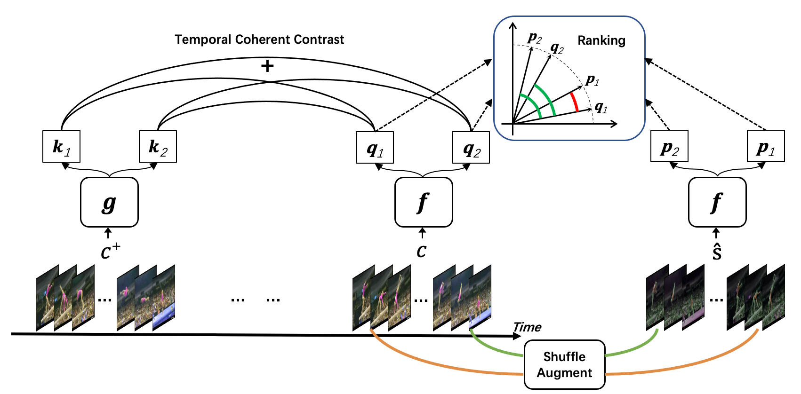
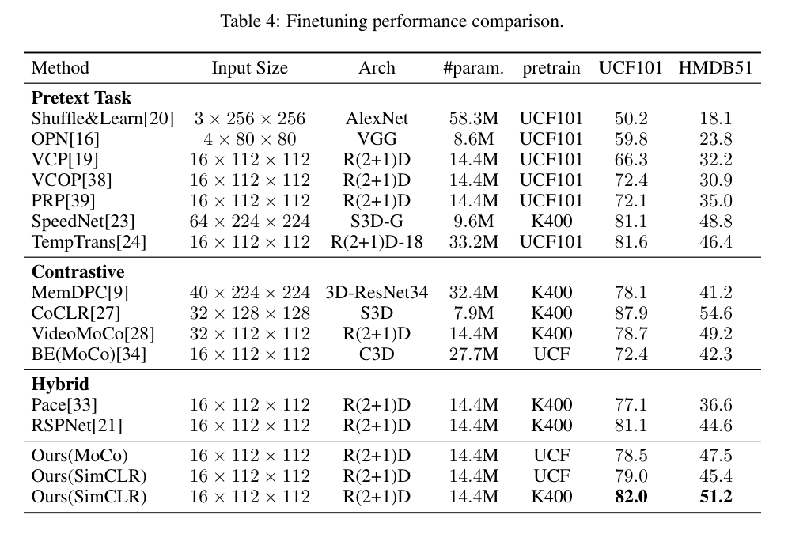
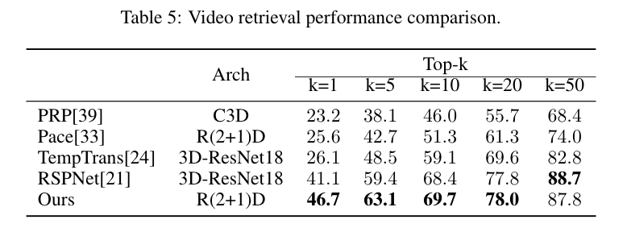
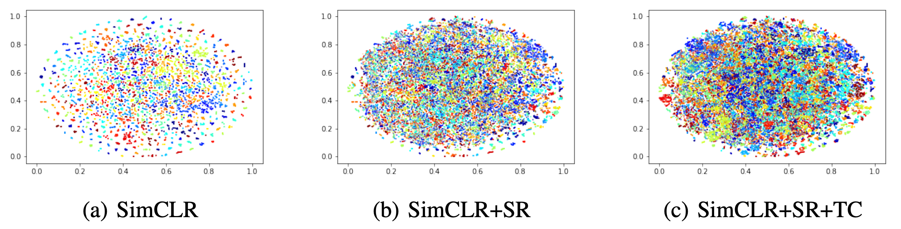

## Official implementation for paper "How Incomplete is Contrastive Learning for Self-supervised Video Recognition? An Inter-intra Variant Dual Representation Method"
Contrastive learning has proven to be effective in self-supervised learning. In this paper, we find that existing contrastive 
learning based solutions for self-supervised video recognition focus on inter-variance encoding but ignore the intra-variance 
existing in clips within the same video. We thus propose to learn dual representations for each clip which (1) 
encode intra-variance through a shuffle and rank pretext task; (2) encode inter-variance through a temporal 
coherent contrastive loss. Experiment results show our method plays an important role in balancing inter and intra variance 
and brings consistent performance gains on multiple backbones and contrastive learning frameworks. Integrated with SimCLR and 
pretrained on Kinetics-400, our method achieves 82.0% and 51.2% downstream finetuning classification accuracy on UCF101 
and HMDB51 test sets respectively and 46.1% video retrieval accuracy on UCF101, outperforming both pretext-task based and 
contrastive learning based counterparts.



# Set up
The code is based on Python3.8 and PyToch 1.8.1.

### Data preparation
1. Download UCF101, HMDB51 and Kinetics400 dataset.
2. Slice videos into frames using ```process_data/src/extract_frame.py```
3. Write sliced frame into csv file using ```process_data/src/write_csv.py```

### Running experiment
Before running code
1. Replace dataset directory in  ```dataset/local_dataset.py```

2. Prepare your own running settings ```paper_scripts/*/*/sh``` 

We provide pretrain, finetune, test and test retrieval command in ``paper_scripts``. We also pack up all commands into one file in ```run``` mode.
Select you running mode ```{mode}``` and experiment name ```{exp}``` , and run

```angular2html
bash paper_scripts/{mode}/{exp}.sh
```

### Peformance comparison





### Feature vistribution visualization




 
